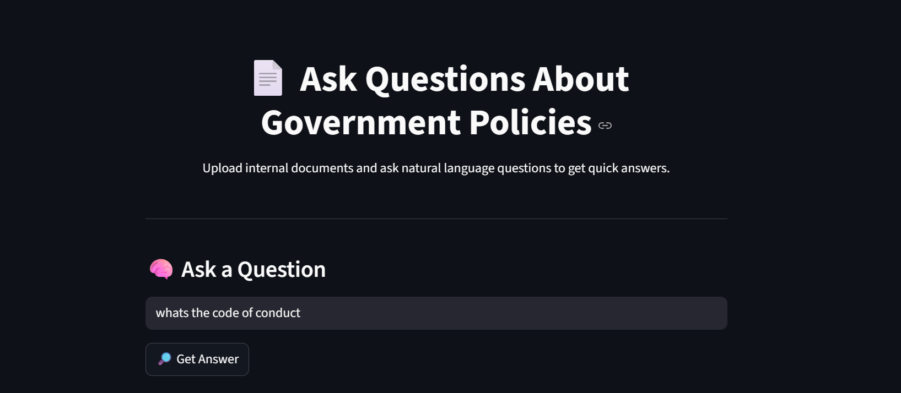
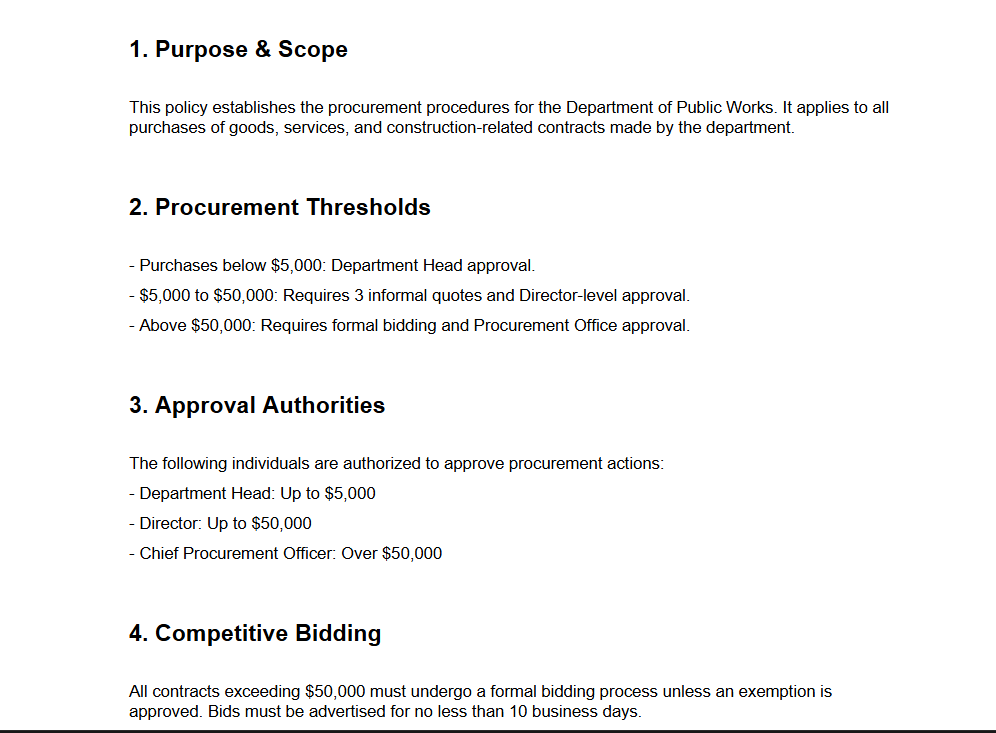
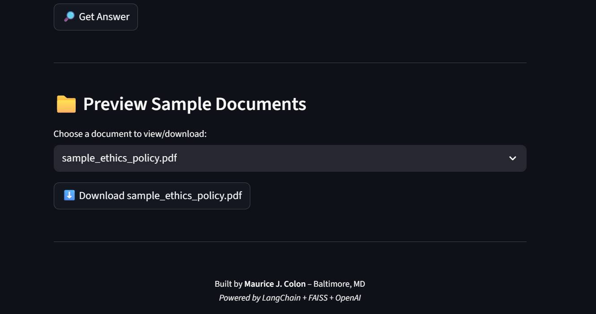

# 🧠 RAG-Based Government Document Q&A Bot


This project builds a secure, private AI chatbot that answers natural language questions from government documents such as policy manuals, SOPs, and procurement guides using a Retrieval-Augmented Generation (RAG) architecture.


## 🔍 Features
- Upload PDFs (e.g., agency policy docs)
- Semantic chunking + vector embeddings (via LangChain + FAISS)
- Ask questions like "What's the procurement threshold?"
- Streamlit UI for interaction


## 📦 Tech Stack
- LLM: OpenAI (GPT-4 Turbo or 3.5)
- Vector Store: FAISS (local)
- Backend: LangChain
- Frontend: Streamlit
- PDF Parsing: PyPDF2

# 📄 RAG-Based Q&A System for Internal Government Documents

Ask natural language questions over internal policy PDFs and get smart answers with source references.

---

### 🧠 What It Does
- Lets users query local government or internal policy PDFs using natural language.
- Uses **Retrieval-Augmented Generation (RAG)** powered by OpenAI, FAISS, and LangChain.
- Extracts answers along with the **source document and text**.
- Lets users preview or download the original documents.

> Built for scenarios like:
> - Procurement offices analyzing contracts
> - Policy teams answering compliance queries
> - Government staff searching documentation

---

### 🛠️ Tech Stack

| Layer        | Tools Used                       |
|--------------|----------------------------------|
| Embedding    | OpenAI (text-embedding-3-small) |
| Vector Store | FAISS (Local)                   |
| Framework    | LangChain                       |
| UI           | Streamlit                       |
| Parsing      | PyPDF2                          |
| Env Mgmt     | dotenv                          |

---

### 📂 Project Structure
```
📁 RAG_GovQA_Project/
├── app.py                 # Streamlit UI
├── rag_pipeline.py        # QA logic
├── ingest.py              # PDF → Chunk → Embedding
├── assets/                # PDF files
├── faiss_index/           # Vector store
├── requirements.txt       # All dependencies
└── README.md
```

---

### ▶️ How To Run This Locally

1. **Clone the repo**
```bash
git clone https://github.com/mjcolon218/RAG-Based Q&A System for Internal Government Docs.git
cd RAG-Based Q&A System for Internal Government Docs
```

2. **Install dependencies**
```bash
pip install -r requirements.txt
```

3. **Set your OpenAI API Key**
```bash
export OPENAI_API_KEY=your_key_here  # or use .env file
```

4. **Embed the documents**
```bash
python ingest.py
```

5. **Run the app**
```bash
streamlit run app.py
```

---

### 📷 Screenshots

#### 🔍 Ask Questions


#### 📚 View Source with Doc Labels


#### 📁 Preview or Download Docs



---

### 🚀 Deploy to Streamlit Cloud
1. Upload project to GitHub.
2. Go to [streamlit.io/cloud](https://streamlit.io/cloud) → New App → Connect GitHub Repo
3. Fill in `app.py` as the entrypoint.
4. Add your OpenAI key as a **secret**.

---

### 📦 Coming Next
- [x] Source metadata tagging
- [x] Source document viewer & download
- [ ] Optional: Document selector for scoped search
- [ ] Streamlit Cloud demo with custom domain

---

### 🧑‍💼 Author
**Maurice J. Colon**  
Baltimore, MD | AWS + Data Engineering Consultant  
[GitHub](https://github.com/mjcolon218) | [LinkedIn](https://linkedin.com/in/mauricejcolon)  

---

**🔐 Project built for internal demos and potential gov tech clients.**

## 🚀 Getting Started
1. Clone the repo
2. Create a `.env` file with your OpenAI key:
```
OPENAI_API_KEY=your-key-here
```
3. Install dependencies:
```
pip install -r requirements.txt
```
4. Run the app:
```
streamlit run app.py
```


## 🧠 Example Use Case
Upload: `sample_policy.pdf`
Ask: "What are the requirements for contract approval over $50,000?"


## 🔐 Security Note
This demo is local. For GovCloud or secure VPC deployment, consider hosting the vector DB and LLM inference in a closed network.


---


© Maurice J. Colon | Baltimore, MD
```